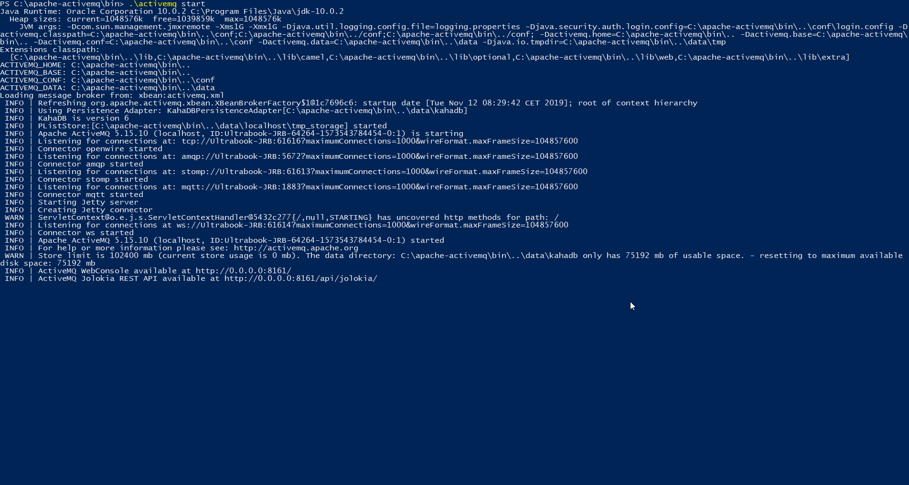
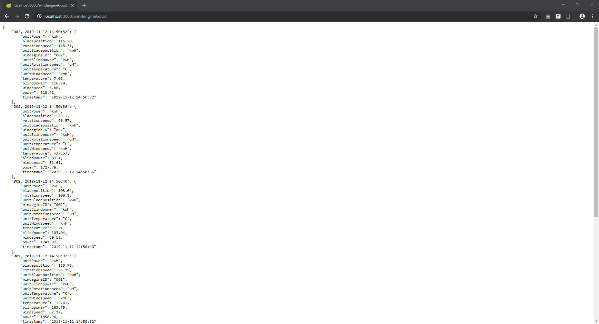
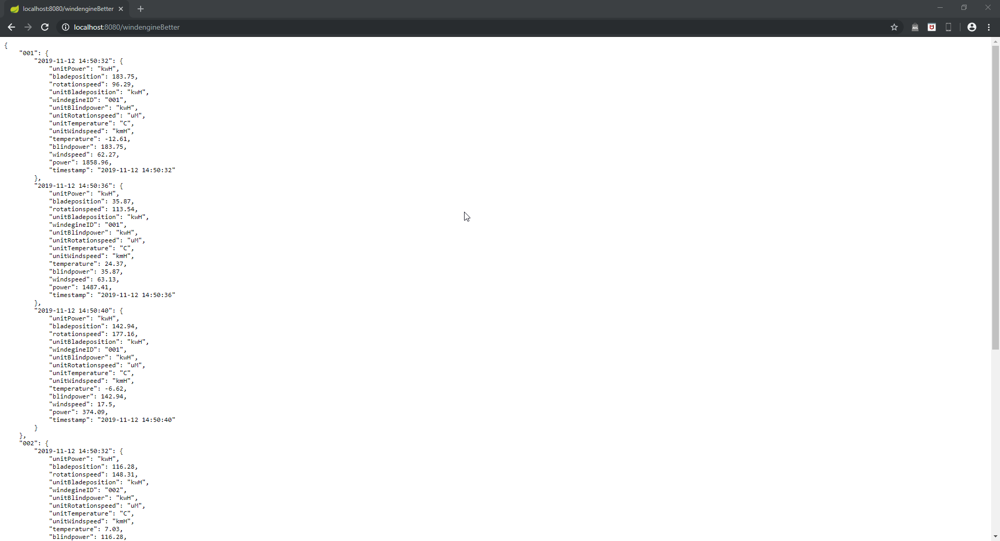
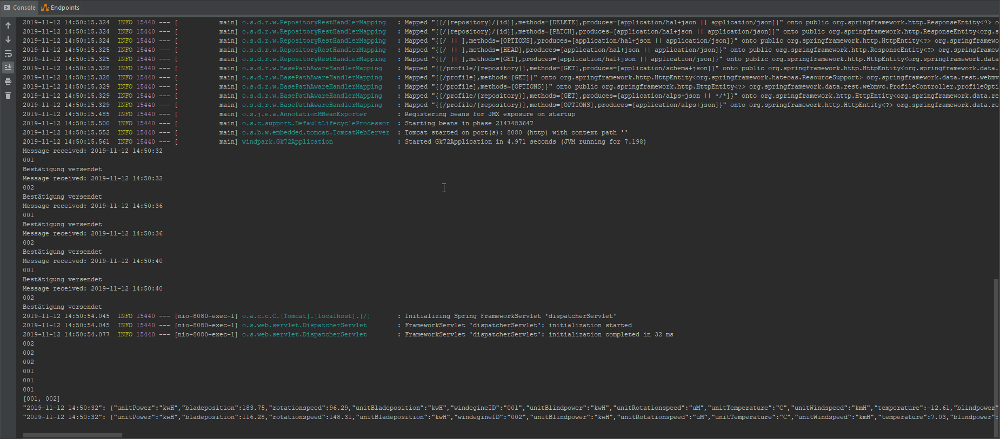
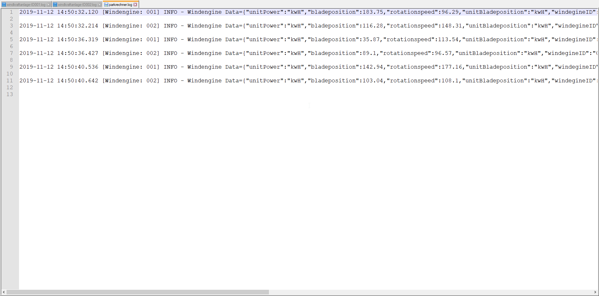
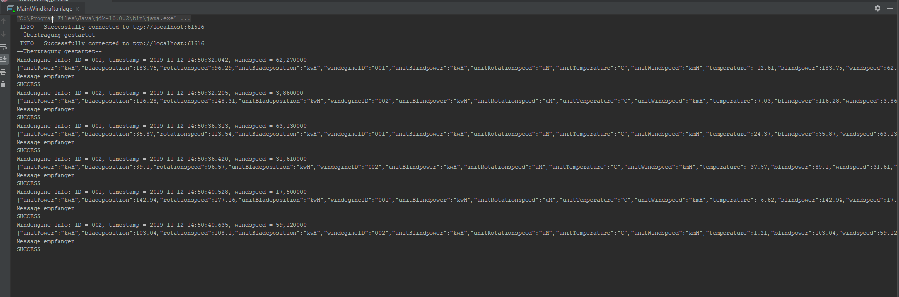
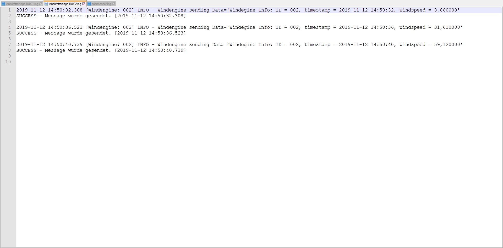
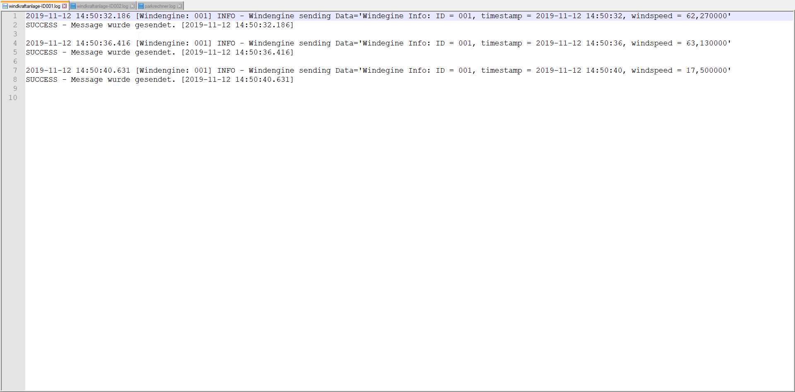

***SYT-Protokoll***                 *GK 733*                                  *Jan R. Borensky*

# SYT - GK-733 (Message Oriented Middleware)

*SYT GK733 DezSys/Middleware Engineering "Message Oriented Middleware" (MICT)*

## Angabe 

### Einführung

Diese Übung soll die Funktionsweise und Implementierung von eine Message Oriented Middleware (MOM) mit Hilfe des **Frameworks Apache Active MQ** demonstrieren. **Message Oriented Middleware (MOM)** ist neben InterProcessCommunication (IPC), Remote Objects (RMI) und Remote Procedure Call (RPC) eine weitere Möglichkeit um eine Kommunikation zwischen mehreren Rechnern umzusetzen.

Die Umsetzung basiert auf einem praxisnahen Beispiel einer Windkraftanalage. Ein Windkraftanalage (Windrad) ist immer Teil eines Verbunds, genannt Windpark. Jede Windkraftanlage beinhaltet einen Rechner, der die Daten der Windkraftanalage aufzeichnet und diese steuern kann. Die Daten werden als REST Schnittstelle in XML oder JSON zur Verfügung gestellt. Die Daten aller Windkraftanlagen eines Windparks werden von einem Parkrechner gesammelt und abgespeichert. Der Parkrechner kommuniziert mit dem Rechenzentrum in der Zentrale. Eine Zentrale kommuniziert mit mehreren Windparks und steuert diese.

### Ziele

Das Ziel dieser Übung ist die **Implementierung einer Kommunikationsplattform für einen Windpark. Dabei erfolgt ein Datenaustausch von mehreren Windkraftanlage mit dem Parkrechner unter Verwendung einer Message Oriented Middleware (MOM)**. Die einzelnen Daten der Windkraftanlage sollen an den Parkrechner übertragen werden. Es sollen **nachrichtenbasierten Protokolle mit Message Queues** verwendet werden. Durch diese lose Kopplung kann gewährleistet werden, dass in Zukunft weitere Anlagen hinzugefügt bzw. Kooperationspartner eingebunden werden können.

Neben der REST-Schnittstelle muss nun eine Schnittstelle bei der Windkraftanlage implementiert werden, die in regelmäßigen Abständen die Daten von der REST-Schnittstelle ausliest und diese in eine Message Queue von **Apache Active MQ** hinzufügt. Um die Datenintegrität zu garantieren, sollen jene Daten, die mit der Middleware übertragen werden in einer LOG-Datei abgespeichert werden.

### Voraussetzungen

- Grundlagen Architektur von verteilten Systemen
- Grundlagen zur nachrichtenbasierten Systemen / Message Oriented Middleware
- Verwendung des Message Brokers Apache ActiveMQ
- Verwendung der XML- oder JSON Datenstruktur der Windkraftanlage
- Verwendung der [JMSChat.jar](https://elearning.tgm.ac.at/mod/resource/view.php?id=78649) JAVA Applikation als Startpunkt für diese Aufgabenstellung
- Verwendung von [Windpark Example with REST/JSON](https://elearning.tgm.ac.at/mod/resource/view.php?id=78834)

### Aufgabenstellung

Implementieren Sie die Windpark-Kommunikationsplattform mit Hilfe des Java Message Service. Verwenden Sie Apache ActiveMQ ([http://activemq.apache.org](http://activemq.apache.org/)) als Message Broker Ihrer Applikation. Das Programm soll folgende Funktionen beinhalten:

- Installation von Apache ActiveMQ am Parkrechner.
- Jede Windkraftanlage erstellt eine Message Queue mit einer ID am Parkrechner.
- Jede Windkraftanlage legt in regelmäßigen Abständen die Daten der Anlage in der Message Queue ab.
- Bei einer erfolgreichen Übertragung empfängt die Windkraftanlage die Nachricht "SUCCESS".
- Der Parkrechner fragt in regelmäßigen Abständen alle Message Queues ab.
- Der Parkrechner fügt alle Daten aller Windkraftanlagen zusammen und stellt diese an einer REST Schnittstelle im JSON/XML Format zur Verfügung.

### Bewertung

- Gruppengröße: 1 Person
- Anforderungen **"überwiegend erfüllt"**
  - Implementierung der Kommunikation zwischen einer Windkraftanlage und dem Parkrechner (JMS Queue)
  - Implementierung der REST Schnittstelle am Parkrechner
  - Zusammensetzung der Daten aller Windkraftanlagen in eine zentrale JSON/XML-Struktur
- Anforderungen **"zur Gänze erfüllt"**
  - Implementierung der Kommunikation mit mehreren Windkraftanlage und dem Parkrechner
  - Rückmeldung des Ergebnisses der Übertragung vom Parkrechner an dieWindkraftanlage (JMS: Topic)
  - LOG-Datei bei jeder Windkraftanlage
  - LOG-Datei für den Par krechner mit allen eingehenden Daten aller Windkraftanlagen

### Fragestellung für Protokoll

- Nennen Sie mindestens 4 Eigenschaften der Message Oriented Middleware?
- Was versteht man unter einer transienten und synchronen Kommunikation?
- Beschreiben Sie die Funktionsweise einer JMS Queue?
- JMS Overview - Beschreiben Sie die wichtigsten JMS Klassen und deren Zusammenhang?
- Beschreiben Sie die Funktionsweise eines JMS Topic?
- Was versteht man unter einem lose gekoppelten verteilten System? Nennen Sie ein Beispiel dazu. Warum spricht man hier von lose? 

### Links & Dokumente

- Grundlagen Message Oriented Middleware: Presentation

  - Middleware:
    [Apache ActiveMQ Installationspaket](http://activemq.apache.org/activemq-5153-release.html)
    [Apache Active MQ 5.14.3 vom Moodle-Server](https://elearning.tgm.ac.at/mod/resource/view.php?id=78648)

- Apache ActiveMQ & JMS Tutorial:

  - http://activemq.apache.org/index.html
  - http://www.academictutorials.com/jms/jms-introduction.asp
  - http://docs.oracle.com/javaee/1.4/tutorial/doc/JMS.html#wp84181
  - http://www.oracle.com/technetwork/systems/middleware/jms-basics-jsp-135286.html
  - http://www.oracle.com/technetwork/articles/java/introjms-1577110.html
  - https://spring.io/guides/gs/messaging-jms/
  - https://docs.spring.io/spring-boot/docs/current/reference/html/boot-features-messaging.html
  - https://dzone.com/articles/using-jms-in-spring-boot-1

  

### Beispiele zu Logging

Parkrechner:
"2019-01-22 01:42:12 [DefaultMessageListenerContainer-1] INFO w.parkrechner.WindparkReceiver - Windengine Data='{"windengineID":"11","timestamp":"2019-01-22 01:41:53.495","windspeed":0.6,"unitWindspeed":"kmH","temperature":21.19,"unitTemperature":"C","power":1485.08,"unitPower":"kwH","blindpower":42.31,"unitBlindpower":"kwH","rotationspeed":126.53,"unitRotationspeed":"uM","bladeposition":30.0,"unitBladeposition":"grad"}


Windkraftanlage:
"2019-01-22 01:44:22 [main] INFO windpark.model.Message - Windengine sending Data='Windengine Info: ID = 35, timestamp = 2019-01-22 01:44:22.275, windspeed = 30.680000"


## Ausarbeitung

### Beantwortung der Fragestellungen

#### Nennen Sie mindestens 4 Eigenschaften der Message Oriented Middleware?

* Es findet eine asynchrone Kommunikation statt.

* Die Kommunikation kann einige Minuten dauern.

* Die Nachrichten werden in eine Queue gesendet.

* Die Grundidee ist es, eine Nachricht in die Queue zu schicken.

  

#### Was versteht man unter einer transienten und synchronen Kommunikation?

* Bei der transienten Kommunikation werden die Nachrichten nur so lange gespeichert solang dieb beiden Beteiligten (Sender und Receiver) laufen.

* Der Sender wird blockiert solange bis es gebuffert und angekommen ist beim Receiver und er die Nachricht verarbeitet hat.

  

#### Beschreiben Sie die Funktionsweise einer JMS Queue?

Jeder kann etwas hineinschicken und jeder kann etwas empfangen. Jeder ist lose gekoppelt niemand ist von irgendwem abhängig.


#### JMS Overview - Beschreiben Sie die wichtigsten JMS Klassen und deren Zusammenhang?

* *ConnectionFactory*:
  ist ein Konfiguration einer Verbindung für den Client damit er eine Verbindung mit dem JMS Provider herstellen kann.

* *Connection*:
  ist eine aktive Client Connection zu seinem JMS Provider

* *Message*:
  Definiert den Message Kopf und gibt eine Rückmeldung für alle Messages

* *MessageListener*
  wird verwendet um asynchrone Nachrichten zu empfangen (benötigt aber natürlich eine ConnectionFactory und eine Message)

  

#### Beschreiben Sie die Funktionsweise eines JMS Topic?

Es gibt Publisher und Subscriber. Wenn man etwas published, geht dies an alle Subscriber.


#### Was versteht man unter einem lose gekoppelten verteilten System? Nennen Sie ein Beispiel dazu. Warum spricht man hier von lose?

Die Änderungen haben nur eine lokale Auswirkung, weshalb es einfacher ist zu implementieren. 

Bsp: Wenn man bei einem Newsletter subscribed

Man empfängt den Newsletter und ist nicht davon abhängig wie er gesendet wird oder wann. Der Parkrechner ist nicht davon abhängig wann ihm wie viele Windkraftanlagen eine Nachricht schicken. 


### Ausarbeitung der Software

#### Installation `Apache Activemq`

1. Installation mithilfe einer Snapshotinstallation
2. Ausführen des Activemq-Dienstes über `active-mq-dir/bin/.\activemq start`




3. Es ist keine Konfiguration notwendig, da die Standardeinstellungen verwendet werden. 


#### Zwei Softwareprojekte

##### Allgemeines:

###### `parkrechner`:

* Empfangen der von allen `Windkraftanlagen` gesendeten Daten
* Senden einer Empfangsbestätigung an die Windkraftanlage  
* Speichern aller empfangenen Daten in ein Log-File
* Darstellung der empfangenen Daten auf einer Website

###### `windkraftanalge`:

* Senden der generierten Informationen an die Message Queue
* Prüfen, ob die Nachricht beim Empfänger angekommen ist
* Speichern der gesendeten Daten und der Information, ob die Daten angekommen sind, in eine Log-File


##### Code

###### Erstellen der Log-Files

1. Erstellen der LOG-Nachricht

```java
try {
            jobject = (JSONObject) p.parse(json);
            info = String.format("%s [Windengine: %s] INFO - Windengine sending Data='Windegine Info: ID = %s, timestamp = %s, windspeed = %f'", s, this.id, jobject.get("windegineID"), jobject.get("timestamp"), jobject.get("windspeed"));
        } catch (ParseException e) {
            System.out.println("Die Syntax des gesendeten String ist nicht valide.");
            e.printStackTrace();
        }
```

2. Hinzufügen zu dem File

```java
File file = new File(String.format("windkraftanlage-ID%s.log",this.id));
fr = new FileWriter(file, true);
fr.write(info);
```


###### Herstellen der Verbindung - MOM

```
ConnectionFactory connectionFactory = new ActiveMQConnectionFactory( user, password, url );
connnection = connectionFactory.createConnection();
connection.start();

// Create the session
session = connection.createSession(false, Session.AUTO_ACKNOWLEDGE);
dest1 = session.createQueue( subject );
dest2 = session.createQueue( subject+"check");

//Create the producer.
producer = session.createProducer(dest1);
producer.setDeliveryMode( DeliveryMode.NON_PERSISTENT );
//Create the consumer.
consumer = session.createConsumer( dest2 );
consumer.setMessageListener(this);
System.out.println("--Übertragung gestartet--");
```


##### Endergebnis:

`parkrechner`

1. Ausgabe mittels REST-Schnittstelle:






2. Output auf der Konsole:




3. Log-File:




`windkraftanlage`

1. Output der Konsole




2. Log-Files:






**Quellen**

https://elearning.tgm.ac.at/mod/assign/view.php?id=71154 

